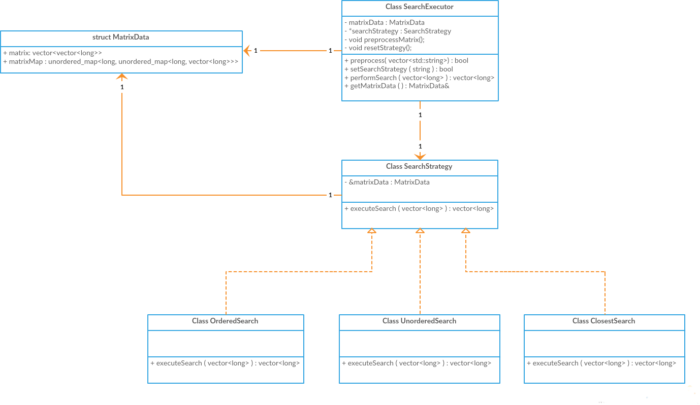

# Netvirta-Coding Challenge

This c++ project is created as part of job interview for Netvirta.
Following is the summary of the requirements given to implement:
- Write a program that searches a 2 dimensional matrix of integers for the row(s) that match a certain selected criteria (each criteria to be implemented as a separate search function)
- When the search program starts up, user must be able to indicate the matrix data file they will be using parameters (argc/argv)
- There are 3 search functions to implement:
    - Find all rows that have a specific sequence of numbers (if that number sequence appears more than once for that row, you only need to print it once)
    - Find all rows that contain all of the required numbers (if number repeats, that row must contain at least that many number)
    - Find the row that has the closest match to a specific number sequence (just need to consider the number of matches)
- Assume that the search function can be performed multiple times (with different number sequence) but using the same matrix data file.
- Assume that the matrix data contains sensitive information, it should not be stored in plain text
- Assume that the search function can be performed multiple times (with different number sequence) but using the same matrix data file
- You are expected to speed up the search time (ie. it should not be linear to the matrix element count)

### Application Design
The application is written in C++ (C++11) and written on Ubuntu OS (16.04). Visual studio code was the IDE used.
The input to the application is a csv file and provided as a command line argument. Since one of the requirement states that this input file has to be secure, the file needs to be encrpyted. To achieve this, a submodule is provided which will encrpyt the input csv file. 
The enc_dec_file.cpp file contains the encryption and decryption logic. XOR cipher, A simple but effective encyption scheme is used to implement this. To build the submodule following build command needs to used. 
```sh
$ g++ -DCREATE_ENC_EXE -I./include ./src/enc_dec_file.cpp -o ./bin/encryptFile -std=c++11
```
The following shows an example of encrpting the input file using the created binary
```sh
$ ./encryptFile
Please provide the name of the file to be encrypted
testfile.csv
Please provide the path where testfile.csv exists
../data
The input file ../data/testfile.csv has been encrypted
The Encrypted file is ../data/enc-testfile.csv
```
The created file has to be used as input to the main search binary. The following command has to be used to build this binary.
```sh
$ g++ -g -I./include ./src/*.cpp -o ./bin/searchExe -std=c++11
```
The following example shows the opearation of the search binary.
```sh
$ $ cat ../data/testfile.csv
1,2,4,5,7,10,30,51
6,10,5,25,1,25,90,-14
10,5,25,6,7,8,30,515
$ cat ../data/enc-testfile.csv
ifz}~amyiefeadm{t
xiefegxs{iez{gxx~iyg}
uxce`amxiczq~gqbpec

$ ./searchExe ../data/enc-testfile.csv

Available Search Commands
1. searchOrdered <sequence of integers>
2. searchUnordered <sequence of integers>
3. searchClosest <sequence of integers>

use "exit" command to exit program
searchOrdered 10 5 25
2 1
searchUnordered 515 10 7
2
searchClosest 10 -14 199 2
0 1 
searchOrdered 1 2 3
-1
```

As seen from the above example, the application provides three search functions and outputs the row indices of the 2d matrix that match the input sequence for a given search condition. If no match is found, -1 is printed.

The units tests for the application are written using google test framework and following can be used to build the test binary. 
```sh
$ g++ -I./include ./test/*test.cpp ./src/enc_dec_file.cpp ./src/*search*.cpp -o bin/testExe -lpthread -lgtest -lgmock -lgtest_main -std=c++11
```

The following shows the class diagram for the application
<p align="center">
  
</p>

As seen from the above diagram, the Strategy Design pattern is used to implement the search functions. Each of the search function is implemented as a seperate class with self contained search logic and each of these class (OrderedSearch, UnorderedSearch, ClosestSearch) are inheriting from the main abstract class (SearchStrategy). This abstract class (interface) is used by the driver class (SearchExecutor) which also contains the matrix preprocess functions. A struct is created with envelops the matrix data that is propopagated among the search classes. This struct contains a preprocessed map which aids in fast searching.

#### Preprocessing Logic

To speed up the search functions, matrix preprocessing is done to structure the matrix in such a way that helps in fast searching. In preprocessing, a nested map is created which enodes the row and position information of each the element present in the 2d matrix. This processing is done one time during startup and stored in the MatrixData struct to be used by target search operations.
```sh
std::unordered_map<long, std::unordered_map<long, std::vector<long>>> matrixmap;
```
As seen in the above snippet, the map contains matirx value as the key and another map as the value. This inner map consists of the row index where the corresponding matrix value appears as key and the array of positions where the value appears in that row as the value.

### Time Complexity of search functions
For a given input 2d matrix of dimensions N*M, follwing gives the time complexity of each search functions.
##### Ordered Search function
The time complexity is O(n * m * l) where,
n: number of rows where the first integer of the input array to be searched appears
m: number of positions that the first integer is found in a given row
l: length of the input array to be searched

The length of n and m are relatively much smaller than N and M respectivley for most of the cases. In worst case they will be equal to N and M if the given array contains only one integer which is repeated N*M times and the input search also contains same integer repeated.

##### Unordered Search function
The time complexity is O(l * n) where,
l: length of the input array to be searched
n: number of rows where the each integer of the input array to be searched appears

In worst case the value of l and n be equal to M(number of columns) and N (number of rows).

##### Closest Search function
The time complexity is O(l * n) where,
l: length of the input array to be searched
n: number of rows where the each integer of the input array to be searched appears

In worst case the value of n will be equal to N and l can much larger than M.


